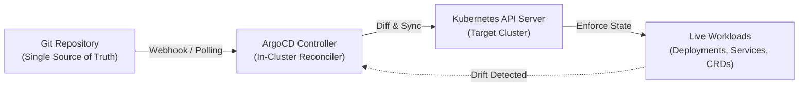

## Introduction

Operating high-reliability infrastructure at scale requires treating every component of your architecture as code. Declarative configuration, automated reconciliation, and continuous observability form the bedrock of resilient cloud systems.

When managing fleet-wide multi-cluster Kubernetes environments across hybrid cloud providers, traditional imperative deployments introduce configuration drift, fragmented state, and un-auditable changes. By adopting a strict GitOps methodology paired with real-time telemetry, platform engineering teams can achieve high deployment velocity while maintaining rigorous reliability.

---

## 1. Declarative State & Continuous Reconciliation with GitOps

By storing the entire cluster topology within version-controlled Git repositories, teams achieve fundamental guarantees:



### Key Architectural Benefits

- **Auditability & Traceability**: Every infrastructure mutation is recorded with author, commit SHA, cryptographic GPG signatures, and review approvals.
- **Automated Drift Detection & Self-Healing**: Controllers continuously compare live cluster state against the desired Git manifests, automatically rolling back unapproved ad-hoc manual changes.
- **Rapid Disaster Recovery**: Restoring an entire environment or spawning an identical cluster in a new cloud region takes minutes via declarative manifests.

---

## 2. Infrastructure as Code (IaC) with Terraform & OpenTofu

Before Kubernetes workloads can be scheduled, underlying cloud fabrics (VPCs, subnets, route tables, IAM roles, and managed node pools) must be declared immutably:

```hcl
module "eks_cluster" {
  source  = "terraform-aws-modules/eks/aws"
  version = "~> 20.0"

  cluster_name    = "production-core-cluster"
  cluster_version = "1.30"

  vpc_id     = module.vpc.vpc_id
  subnet_ids = module.vpc.private_subnets

  eks_managed_node_groups = {
    compute = {
      instance_types = ["m6i.xlarge"]
      min_size       = 3
      max_size       = 10
      desired_size   = 3
    }
  }

  enable_cluster_creator_admin_permissions = false
}
```

By decoupling base infrastructure provisioning (Terraform) from application lifecycle reconciliation (ArgoCD), we prevent lock contention and isolate blast radiuses.

---

## 3. The Three Pillars of Cloud Observability

Continuous deployment is only as safe as the observability system that monitors it. We construct telemetry upon three foundational layers:

### 3.1 Metrics: Prometheus & Grafana
Capturing real-time latency percentiles (P50, P90, P99), pod scheduling delays, saturation indices, and HTTP status distributions using Prometheus scrapers and alertmanager routes.

### 3.2 Structured Distributed Tracing
OpenTelemetry sidecars and eBPF kernel probes propagate W3C Trace Context across RPC boundaries, attributing microservice latency bottlenecks down to specific database queries or outbound network hops.

### 3.3 Logs & Automated Runbooks
Centralized JSON logging enriched with cluster metadata, container IDs, and correlation keys, paired with automated self-healing controllers that execute progressive canary rollouts and instant rollback triggers on anomalous error rate surges.
