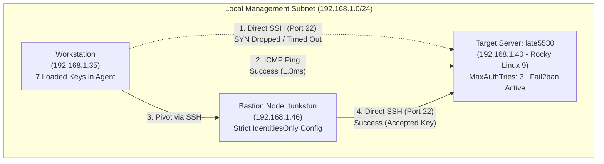
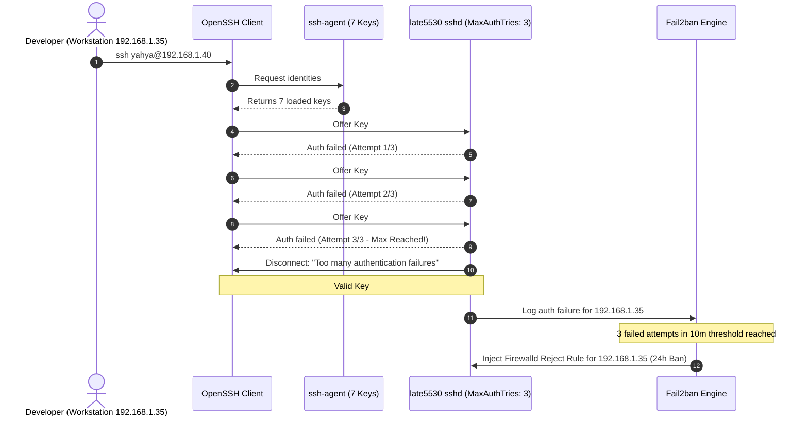

# The Ghost in the Firewall: SSH-Agent Bloat, Fail2ban, and the "Trusted Device" Myth

**Published:** September 11, 2026  
**Author:** Yahya Khan ([@yahyaoncloud](https://github.com/yahyaoncloud))  
**Domain:** System Administration, Network Security, SRE & Infrastructure Engineering  
**Target Topology:** Hybrid Homelab / Edge Production (`workstation` -> `tunkstun` bastion -> `late5530` edge server)  

---

## The Incident: An Unexplained Lockout

In distributed systems and hybrid homelabs, predictable access is fundamental. When remote command execution fails without an obvious configuration change, the immediate instinct is often to blame the physical network layer, an interface bounce, or a misconfigured routing table.

Today, while attempting to manage our Rocky Linux 9 edge server (`late5530` at `192.168.1.40`) directly from the primary workstation (`192.168.1.35`), connections ground to a sudden halt:

```bash
$ ssh yahya@192.168.1.40
# ... hangs indefinitely until timeout ...
```

Testing raw TCP socket connectivity confirmed the hang:

```bash
$ nc -zv -w 2 192.168.1.40 22
nc: connect to 192.168.1.40 port 22 (tcp) timed out: Operation now in progress
```

Yet, standard Layer 3 ICMP echo requests succeeded with low latency and zero packet loss:

```bash
$ ping -c 2 192.168.1.40
PING 192.168.1.40 (192.168.1.40) 56(84) bytes of data.
64 bytes from 192.168.1.40: icmp_seq=1 ttl=64 time=1.33 ms
64 bytes from 192.168.1.40: icmp_seq=2 ttl=64 time=1.37 ms

--- 192.168.1.40 ping statistics ---
2 packets transmitted, 2 received, 0% packet loss, time 1001ms
rtt min/avg/max/mdev = 1.333/1.353/1.373/0.020 ms
```

Even more perplexing: pivoting through our secondary node (`tunkstun` at `192.168.1.46`) allowed seamless, instant SSH access to `late5530`:

```bash
workstation (192.168.1.35) $ ssh tunkstun
tunkstun (192.168.1.46)    $ ssh late5530
[yahya@LATE5530 ~]$ # Succeeded immediately!
```

This gave rise to an immediate operational question: **Why was `tunkstun` the only "trusted device" permitted to connect, and why was the primary workstation silently dropped on port 22?**

Was there an uncommitted IP whitelist? A rogue MAC filter on the Wi-Fi AP? Or had our host defense automation turned against us?

---

## The Investigation Architecture

The environment under investigation consists of three machines sharing the `192.168.1.0/24` subnet:



---

## Step 1: Inspecting the Target Host's Firewall

Because ICMP ping succeeded but TCP port 22 timed out without a `RST` (connection refused) packet, the packets were being dropped or rejected by a packet filter before reaching the application socket.

Pivoting through `tunkstun`, we inspected `firewalld` on `late5530`:

```bash
$ sudo firewall-cmd --list-all-zones
```

Among the inactive zones, the active `drop` zone bound to the wireless interface `wlp2s0` revealed the smoking gun:

```ini
drop (active)
  target: DROP
  icmp-block-inversion: no
  interfaces: wlp2s0
  sources: 
  services: ssh
  ports: 
  protocols: 
  forward: yes
  masquerade: no
  forward-ports: 
  source-ports: 
  icmp-blocks: 
  rich rules: 
	rule family="ipv4" source address="192.168.1.0/24" port port="3000" protocol="tcp" accept
	rule family="ipv4" source address="192.168.1.0/24" port port="22" protocol="tcp" accept
	rule family="ipv4" source address="192.168.1.0/24" icmp-type name="echo-request" accept
	rule family="ipv4" source address="192.168.1.0/24" port port="10020" protocol="tcp" accept
	rule family="ipv4" source address="192.168.1.0/24" port port="9090" protocol="tcp" accept
	rule family="ipv4" source address="192.168.1.35" port port="22" protocol="tcp" reject type="icmp-port-unreachable"
```

Look closely at the final rich rule:

```text
rule family="ipv4" source address="192.168.1.35" port port="22" protocol="tcp" reject type="icmp-port-unreachable"
```

While the entire subnet `192.168.1.0/24` was permitted on port 22, the single IP `192.168.1.35` (our workstation) was singled out with an explicit `reject` directive.

Inspecting the underlying kernel `nftables` ruleset confirmed it:

```nft
chain filter_IN_drop_deny {
    ip saddr 192.168.1.35 tcp dport 22 reject with icmp port-unreachable
}
```

Who inserted this rule?

---

## Step 2: Unmasking the Culprit — Automated Fail2ban Jails

A quick inspection of active daemon processes pointed straight to host intrusion prevention:

```bash
$ sudo fail2ban-client status sshd
Status for the jail: sshd
|- Filter
|  |- Currently failed: 0
|  |- Total failed:     4
|  `- Journal matches:  _SYSTEMD_UNIT=sshd.service + _COMM=sshd + _COMM=sshd-session
`- Actions
   |- Currently banned: 1
   |- Total banned:     1
   `- Banned IP list:   192.168.1.35
```

Fail2ban had registered authentication failures from `192.168.1.35` and executed its `firewallcmd-rich-rules` action, injecting the dynamic reject rule into firewalld.

Checking `/var/log/fail2ban.log`:

```text
2026-09-11 17:16:50,584 fail2ban.filter [927]: INFO   [sshd] Found 192.168.1.35 - 2026-09-11 17:16:50
2026-09-11 17:25:22,827 fail2ban.filter [927]: INFO   [sshd] Found 192.168.1.35 - 2026-09-11 17:25:22
2026-09-11 17:31:48,327 fail2ban.filter [927]: INFO   [sshd] Found 192.168.1.35 - 2026-09-11 17:31:47
2026-09-11 17:33:43,325 fail2ban.filter [927]: INFO   [sshd] Found 192.168.1.35 - 2026-09-11 17:33:42
2026-09-11 17:33:43,898 fail2ban.actions [927]: NOTICE [sshd] Ban 192.168.1.35
```

With `maxretry = 3` and `findtime = 10m` defined in `/etc/fail2ban/jail.local`, the repeated failures triggered an automated 24-hour ban (`bantime = 24h`).

Now the critical question arose: **Why was our workstation failing SSH authentication in the first place? We had generated an Ed25519 key pair specifically for this server and authorized it in `~/.ssh/authorized_keys`!**

---

## Step 3: The Root Cause — `MaxAuthTries` vs `ssh-agent` Key Bloat

To uncover why authentication failed, we audited `journalctl -u sshd` on the server during the incident window:

```text
Sep 11 17:33:42 LATE5530 sshd-session[179261]: error: maximum authentication attempts exceeded for yahya from 192.168.1.35 port 55730 ssh2 [preauth]
Sep 11 17:33:42 LATE5530 sshd-session[179261]: Disconnecting authenticating user yahya 192.168.1.35 port 55730: Too many authentication failures [preauth]
```

Notice the exact error message:
> `Too many authentication failures [preauth]`  
> `error: maximum authentication attempts exceeded`

### 1. Server-Side Hardening: `MaxAuthTries 3`
Querying the running OpenSSH configuration on `late5530`:

```bash
$ sudo sshd -T | grep -i maxauthtries
maxauthtries 3
```

`MaxAuthTries` specifies the maximum number of authentication attempts permitted per connection. If more than 3 authentication methods or public keys are evaluated without success, the server terminates the TCP connection.

### 2. Client-Side State: Key Proliferation in `ssh-agent`
On our development workstation, we handle multiple git accounts, cloud providers, and servers. Running `ssh-add -l` revealed **7 keys** loaded in memory:

```bash
$ ssh-add -l
256 SHA256:U56zYsml4HB78XuCpEKDid3tRk6repa8wrJ1fJs/7Ws ytp24 (ED25519)
256 SHA256:gIXNsVBlmSZvsxUR+bhINP3jNWX8KXF0SVeRTjbV7O8 ykinwork1@gmail.com (ED25519)
256 SHA256:rZDyPxrICI4WUQALFBNtNzjbhAqw8LV/4sts8QeZCf8 aburcloud@gmail.com (ED25519)
256 SHA256:YX0BkMpdt/De2wGTyfdBfVHk0ai2OLeV7DwnFvoGFF0 tp24@workstation (ED25519)
256 SHA256:j8zCyCeV5Ed5PjIAwSTiywLC/SptPPyBgUZ7DY3E73g tp24@workstation (ED25519) # <-- MATCHING KEY!
256 SHA256:6F3oGOSOiy7OH9KFWDXVbeaupJ5A1haZ7XqhIorZE6k johnwick4learning@gmail.com (ED25519)
256 SHA256:E8Tr29hUjpZVmc8ZK5OKMn+YHCCeTDISGyA2PI/EjCs yahyakhan.islam2@gmail.com (ED25519)
```

Now let's compare this with the authorized keys on `late5530` (`~/.ssh/authorized_keys`):

```text
ssh-ed25519 AAAAC3NzaC1lZDI1NTE5AAAAIOW7T7UEPcCEaR4NrwRuxdJyigxJEeXMXKApcWnnH+S0 tp24@workstation
```

Computing its SHA-256 fingerprint:

```bash
$ ssh-keygen -lf /dev/stdin <<< "ssh-ed25519 AAAAC3NzaC1lZDI1NTE5AAAAIOW7T7UEPcCEaR4NrwRuxdJyigxJEeXMXKApcWnnH+S0 tp24@workstation"
256 SHA256:j8zCyCeV5Ed5PjIAwSTiywLC/SptPPyBgUZ7DY3E73g tp24@workstation (ED25519)
```

The valid key was present and authorized! **However, it was Key #5 in the agent's probe sequence.**

### 3. The Mechanics of the SSH Handshake Failure
When an OpenSSH client initiates a connection without an explicit identity override:
1. It queries `ssh-agent` for all loaded keys.
2. It sends public key probes sequentially to the server.
3. The server checks each key against `authorized_keys`.
4. If a key doesn't match, the attempt counter increments.



Because `late5530` capped attempts at 3, the server severed the connection on Key #3. Key #5 was never presented, resulting in repeated failures that triggered the 24-hour Fail2ban ban.

---

## Step 4: Debunking the "Trusted Device" Myth

Why did `tunkstun` succeed effortlessly while the workstation failed?

Was `tunkstun` specially whitelisted in Fail2ban or the firewall? **No.**

The answer lay entirely in `tunkstun`'s local `~/.ssh/config`:

```ssh
# LATE5530 Rocky Linux 9 Server (Tailscale 100.66.64.31, Wi-Fi 192.168.1.40, Ethernet 192.168.1.51)
Host LATE5530 late5530 100.66.64.31 192.168.1.40 192.168.1.51
  HostName 192.168.1.40
  User yahya
  IdentityFile ~/.ssh/tunkstun
  IdentitiesOnly yes
  StrictHostKeyChecking no
```

Compare that with the workstation's `~/.ssh/config`:

```ssh
Host late5530
    HostName 192.168.1.40
    User yahya
    IdentityFile ~/.ssh/late5530
    IdentitiesOnly yes
```

### The Architectural Flaw
1. **On `tunkstun`**: The `Host` directive included the raw IP addresses (`100.66.64.31 192.168.1.40 192.168.1.51`). Whether running `ssh late5530` or `ssh yahya@192.168.1.40`, the configuration block was evaluated. `IdentitiesOnly yes` ensured that OpenSSH **never queried `ssh-agent`** and offered only `~/.ssh/tunkstun` on Attempt 1.
2. **On the workstation**: The block only matched the alias `late5530`. When running:
   ```bash
   ssh yahya@192.168.1.40
   ```
   OpenSSH bypassed the block entirely, fell back to default behavior, dumped all 7 agent keys onto the server, and triggered the lockout.

`tunkstun` was never a "trusted device"—it was simply an SSH client configured to avoid agent probing!

---

## The Remediation Runbook

### Phase 1: Unban the Workstation IP
From an active session (via `tunkstun` or console access), release the IP from the Fail2ban jail:

```bash
$ sudo fail2ban-client set sshd unbanip 192.168.1.35
192.168.1.35
```

Verify that the dynamic rich rule in firewalld has been expunged:

```bash
$ sudo firewall-cmd --zone=drop --list-rich-rules
# The reject rule for 192.168.1.35 is now removed.
```

---

### Phase 2: Fortify Client-Side SSH Configuration
Update `~/.ssh/config` on the workstation to match both the symbolic hostname and the static IP addresses, locking down key presentation:

```ssh
Host late5530 192.168.1.40
    HostName 192.168.1.40
    User yahya
    IdentityFile ~/.ssh/late5530
    IdentitiesOnly yes
    StrictHostKeyChecking accept-new
```

With `IdentitiesOnly yes` bound to the IP pattern, `ssh yahya@192.168.1.40` will only present `~/.ssh/late5530`. The handshake completes on Attempt 1 of 3.

---

### Phase 3: Whitelist Administrative Subnets in Fail2ban
While Fail2ban provides critical perimeter defense, internal management networks should never suffer self-inflicted lockouts during development.

On `late5530`, edit `/etc/fail2ban/jail.local`:

```ini
[DEFAULT]
bantime = 1h
findtime = 10m
maxretry = 5
banaction = firewallcmd-rich-rules
backend = systemd

# Whitelist localhost and the trusted management subnet
ignoreip = 127.0.0.1/8 ::1 192.168.1.0/24

[sshd]
enabled = true
port = 22
filter = sshd
maxretry = 3
findtime = 10m
bantime = 24h
```

Reload the Fail2ban configuration:

```bash
$ sudo fail2ban-client reload
```

Confirm that `ignoreip` is active:

```bash
$ sudo fail2ban-client get sshd ignoreip
127.0.0.1/8 ::1 192.168.1.0/24
```

---

## SRE & Platform Engineering Takeaways

| Security / Ops Dimension | Root Vulnerability | Resilient Architecture Pattern |
| :--- | :--- | :--- |
| **SSH-Agent Hygiene** | Accumulating keys in memory causes OpenSSH to spray unrelated credentials until `MaxAuthTries` aborts. | Always use `IdentitiesOnly yes` in `~/.ssh/config` and associate rules with IP patterns as well as host aliases. |
| **Server Hardening Limits** | Tight `MaxAuthTries` values (e.g. 3) inadvertently turn client agent bloat into an accidental Denial of Service. | Coordinate server authentication quotas with client tooling practices. |
| **Intrusion Defense Automation** | Fail2ban cannot distinguish between an unauthorized brute-force attacker and an engineer with too many agent keys. | Define explicit `ignoreip` CIDRs for out-of-band and internal management networks. |
| **Network Triage Methodology** | Successful Layer 3 (ping) alongside silent Layer 4 (SYN timeout) points directly to stateful packet filtering. | Inspect dynamic chains (`nftables` / `firewalld rich rules`) before troubleshooting physical links or NICs. |

---

## Summary

What initially appeared to be an esoteric network partition or an undocumented device trust model was actually the collision of two standard security controls:
1. An SSH server enforcing strict attempt limits (`MaxAuthTries 3`).
2. An intrusion daemon automatically dropping repeat offenders (`Fail2ban`).

By enforcing `IdentitiesOnly yes` across all target patterns and defining an explicit management subnet whitelist in Fail2ban, we restored deterministic, secure connectivity across the hybrid infrastructure.
