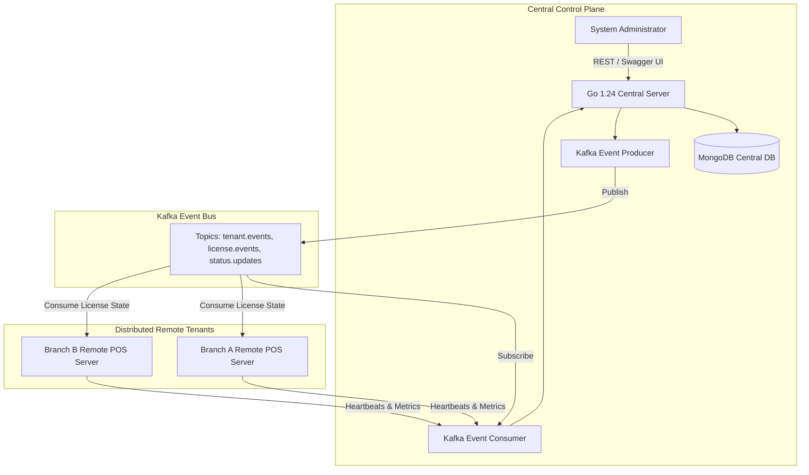

## Executive Summary

AburPOS Central System is a high-availability cloud control plane designed to manage distributed point-of-sale (POS) deployments across multi-branch enterprise networks. Built with Go 1.24, Apache Kafka, and MongoDB, it centralizes tenant lifecycle orchestration, cryptographic license validation, remote server health monitoring, and asynchronous state synchronization.

---

## Key Features & Capabilities

- **Tenant Lifecycle Provisioning**: Automated onboarding workflows for new tenant accounts, provisioning isolated remote POS instance bindings and tenant status state machines.
- **Tier-Based License Management**:
  - **Small Tier**: 1 branch, up to 5 concurrent cashier/staff users.
  - **Medium Tier**: Up to 5 branches, up to 25 concurrent users.
  - **Enterprise Tier**: Unlimited branches, unrestricted users, priority telemetry streaming.
- **Event-Driven Asynchronous Synchronization**:
  - **Emitted Events**: `tenant.created`, `tenant.status.changed`, `license.updated`, `license.expired`.
  - **Ingested Events**: `server.heartbeat`, `tenant.metrics`, `error.report`.
- **Remote Server Health Telemetry**: Live heartbeat ingestion monitoring remote node uptime, database connectivity, and transaction processing latency.
- **Comprehensive API Documentation**: Fully interactive Swagger/OpenAPI documentation served natively at `/swagger/index.html`.
- **Resilient Cloud Infrastructure**: Systemd unit configuration optimized for production deployment on cost-effective AWS EC2 instances with automatic self-healing.

---

## Technical Highlights

1. **Decoupled Event Architecture**: Implements a hexagonal architectural pattern allowing Kafka event streaming to operate in full cluster mode or transparently fall back to direct synchronization during local development.
2. **Cryptographic License Enforcement**: Digital signatures and periodic heartbeat re-validation preventing unauthorized offline usage or branch quota violations.
3. **Structured JSON Configuration**: Centralized, environment-aware configuration controlling MongoDB connection pools, Kafka cluster broker topics, and JWT signing keys.
