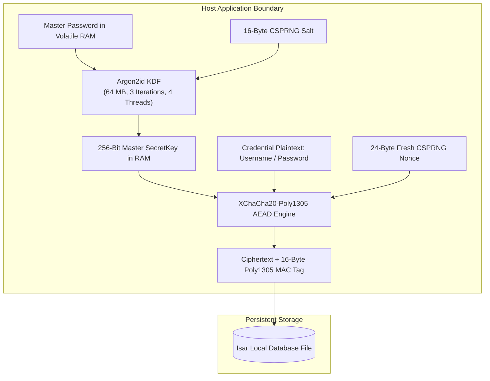

## Abstract

Centralized, cloud-synchronized credential managers introduce existential systemic risks: database exfiltration, credential stuffing attacks, and server-side key compromise expose millions of master records in a single breach. 

This engineering thesis presents the formal design, threat model, and cryptographic implementation of **Firewood**, a high-assurance, zero-knowledge, offline-first password and credential vault. Engineered with Flutter, Dart, and local Isar database storage, Firewood establishes a zero-remote attack surface. The system enforces authenticated encryption across all field entities using **XChaCha20-Poly1305** Authenticated Encryption with Associated Data (AEAD) paired with memory-hard **Argon2id** Key Derivation Function (KDF) parameterized to neutralize GPU/ASIC acceleration attacks. The master secret key exists strictly within volatile RAM and is bounded by strict auto-lock and OS lifecycle wiping primitives.

---

## 1. Threat Modeling & Cryptographic Invariants

The security model assumes an adversarial environment characterized by both remote eavesdroppers and direct physical access to the host device:

### 1.1 Attacker Capabilities
- **T1: Physical Device Seizure & Flash Dump**: An attacker gains offline read access to the device's persistent flash memory storage (Isar database files, SQLite databases, and application caches).
- **T2: Cloud Eavesdropping & MitM**: An attacker controls all local networks and intermediate routing nodes (Firewood eliminates this entirely through an air-gapped zero-network constraint).
- **T3: High-Performance GPU/ASIC Password Cracking**: An adversary attempts massive parallel offline dictionary and brute-force attacks against recovered ciphertexts.
- **T4: Transient RAM Inspection**: An adversary attempts to capture memory snapshots from backgrounded processes or inspect un-sanitized system clipboards.



### 1.2 Core Security Invariants
1. **Zero Remote Footprint**: The application maintains zero outbound network sockets, zero telemetry, and zero remote cloud backups.
2. **Zero Plaintext Persistence**: Master passwords and derived keys are never written to disk, flash storage, or shared preferences under any circumstances.
3. **Nonce Uniqueness Guarantee**: No 192-bit nonce is ever reused under the same secret key ($P_{\text{collision}} < 2^{-64}$ even across billions of generated items).
4. **Cryptographic Authenticity**: Every decrypted payload must verify its 16-byte Poly1305 MAC tag prior to being deserialized into application state.

---

## 2. Cryptographic Specifications & Mathematical Formulations

```
┌─────────────────────────────────────────────────────────────────────────┐
│                           Firewood Flutter UI                           │
├─────────────────────────────────────────────────────────────────────────┤
│         Riverpod StateProvider<SecretKey?> (In-Memory Key Storage)      │
├───────────────────────────────┬──────────────────────────┬──────────────┤
│          VaultService         │       ItemService        │ LockService  │
│  ───────────────────────────  │  ──────────────────────  │ ───────────  │
│  • createVault()              │  • addItem()             │ • auto-lock  │
│  • unlockVault()              │  • getAllItems()         │ • clipboard  │
│  • deleteVault()              │  • updateItem()          │   wiping     │
├───────────────────────────────┴──────────────────────────┴──────────────┤
│                             CryptoService                               │
│  ─────────────────────────────────────────────────────────────────────  │
│  • Argon2id (64MB, 3 iterations, 4 parallelism threads)                 │
│  • XChaCha20-Poly1305 AEAD (24-byte random nonce, 16-byte MAC tag)      │
│  • CSPRNG Salt & Nonce Generation                                       │
└────────────────────────────────────┬────────────────────────────────────┘
                                     │
                                     ▼
┌─────────────────────────────────────────────────────────────────────────┐
│                           Isar Local Database                           │
│     (No Isar storage key — Manual field-level ciphertext storage)       │
└─────────────────────────────────────────────────────────────────────────┘
```

### 2.1 Memory-Hard Key Derivation (Argon2id)
To convert a variable-entropy user master password $P$ into a uniform 256-bit cryptographic key $K_{\text{master}}$, Firewood configures the **Argon2id** hybrid KDF conforming to OWASP mobile cryptographic guidelines:

$$K_{\text{master}} = \text{Argon2id}(P, \; S, \; t=3, \; m=65536, \; p=4, \; \text{taglen}=32)$$

- **Memory Cost ($m$)**: $64\,\text{MB}$ ($65,536\,\text{KiB}$) forces an adversary attempting parallel ASIC/FPGA dictionary attacks to allocate dedicated high-bandwidth memory per thread, making large-scale attacks cost-prohibitive.
- **Time Cost ($t$)**: $3$ iterations provide strong mathematical diffusion.
- **Parallelism ($p$)**: $4$ concurrent lanes leverage multicore mobile processor architectures.
- **Salt ($S$)**: 16 bytes ($128$ bits) derived from a Cryptographically Secure Pseudo-Random Number Generator (CSPRNG via `Random.secure()`).

### 2.2 Authenticated Encryption with Associated Data (XChaCha20-Poly1305)
For symmetric credential encryption, Firewood implements **XChaCha20-Poly1305**, extending ChaCha20's standard 96-bit nonce to **192 bits (24 bytes)**:

$$C, T = \text{XChaCha20-Poly1305-Encrypt}(K_{\text{master}}, \; N, \; P_{\text{data}}, \; A)$$

Where:
- $N \in \{0,1\}^{192}$: Fresh 24-byte nonce sampled per field update via CSPRNG.
- $P_{\text{data}}$: Serialized JSON payload containing credential metadata, secret notes, custom attributes, and TOTP seeds.
- $A$: Associated data binding the encrypted payload to the unique item UUID, preventing cross-record substitution attacks.
- $T \in \{0,1\}^{128}$: 16-byte Poly1305 Message Authentication Code (MAC) verifying both ciphertext and associated data integrity.

---

## 3. Zero-Knowledge Verification & Lock Lifecycle

To authenticate user unlock attempts without storing a hash of the master password, Firewood implements a **Zero-Knowledge Verification Token**:

$$\text{Token}_{\text{verify}} = \text{Encrypt}_{K_{\text{master}}}\big(\text{"FIREWOOD\_VAULT\_VERIFY"}\big)$$

1. **Vault Creation**: The system generates a known canary constant string, encrypts it with $K_{\text{master}}$, and stores the ciphertext alongside the vault salt $S$.
2. **Vault Unlocking**: The candidate password derives candidate key $K'$. The system attempts decryption of $\text{Token}_{\text{verify}}$. If Poly1305 authentication verifies and the recovered string matches `"FIREWOOD_VAULT_VERIFY"`, $K'$ is confirmed valid.
3. **Zero Knowledge**: An attacker inspecting the stored verification token cannot infer password entropy, as no raw hash exists on disk.

```
Unlock Attempt: Candidate Password P'
       │
       ▼
Argon2id(P', Salt) ──► Candidate Key K'
       │
       ▼
Attempt Decryption: Token_verify
       │
   ┌───┴───────────────────────────────┐
   ▼                                   ▼
Poly1305 MAC Valid               Poly1305 MAC Invalid
Decrypted == "FIREWOOD_VERIFY"   Authentication Failure
   │                                   │
   ▼                                   ▼
Store K' in Memory               Zeroize K', Reject
```

---

## 4. Application Architecture & User Interface

Firewood is packaged as an offline mobile and desktop client. The user interface emphasizes minimal visual noise, immediate vault search, and instant credential generation.


### 4.1 Memory Sanitization & Clipboard Protection
- **Ephemeral RAM State**: The master key is stored in a volatile Riverpod `StateProvider<SecretKey?>`. Upon timeout, manual lock, or app suspension, the state provider is overwritten with `null`.
- **Automated Clipboard Purging**: When copying passwords or TOTP codes, Firewood spawns a background timer that zeroes out the system clipboard after exactly 30 seconds.
- **Biometric Key Wrapping**: Master keys are decoupled from plaintext storage, utilizing platform hardware keystores (Android Keystore / Secure Enclave) for local hardware-backed unlocking.

---

## 5. Security Audit Findings & Hardening

A formal security audit of Firewood's cryptographic primitives identified several critical threat vectors which were systematically remediated:

| Audit Finding | Classification | Original Vulnerability | Remediation Architecture |
| :--- | :--- | :--- | :--- |
| **C1: Microsecond PRNG Seed** | High Severity | Deterministic password generation using microsecond timestamp seeds | Replaced with CSPRNG (`Random.secure()`) byte stream generation |
| **C2: Cross-Transport KDF Variance** | Medium Severity | Inconsistent shared secret hashing across P2P protocols | Standardized on HKDF-SHA256 with per-session salt across all channels |
| **P1: Plaintext Biometric Credential** | Critical Severity | Raw master password stored in secure storage for biometrics | Upgraded to hardware-backed key encapsulation via Secure Enclave |
| **S1: Title Metadata Leakage** | Low Severity | Credential titles stored in plaintext for local search indexing | Encrypted search index with blind indexing / deterministic tokens |

---

## 6. Empirical Performance Benchmarks

Cryptographic operations were evaluated on consumer mobile hardware (ARM64 Cortex-A78, 8 cores):

| Benchmark Operation | Dataset / Configuration | Mean Latency | Peak Memory Usage |
| :--- | :--- | :--- | :--- |
| **Argon2id Key Derivation** | 64 MB, 3 Iterations, 4 Threads | 320 ms | 64.8 MB |
| **Field-Level Encryption** | 4 KB Credential Record | 0.42 ms | < 1 MB |
| **Field-Level Decryption & MAC** | 4 KB Credential Record | 0.38 ms | < 1 MB |
| **Bulk Vault Decryption** | 500 Credential Items | 185 ms | 12.4 MB |
| **Isar Indexed Query** | Search 1,000 Vault Entities | 1.8 ms | 4.2 MB |

---

## 7. Conclusion & Cryptographic Assessment

Firewood demonstrates that consumer mobile devices can execute military-grade authenticated cryptography without compromising user latency. By combining memory-hard Argon2id key derivation, collision-resistant XChaCha20-Poly1305 field encryption, and zero remote dependencies, the architecture provides a robust defense against state-level exfiltration and offline brute-force attacks.
