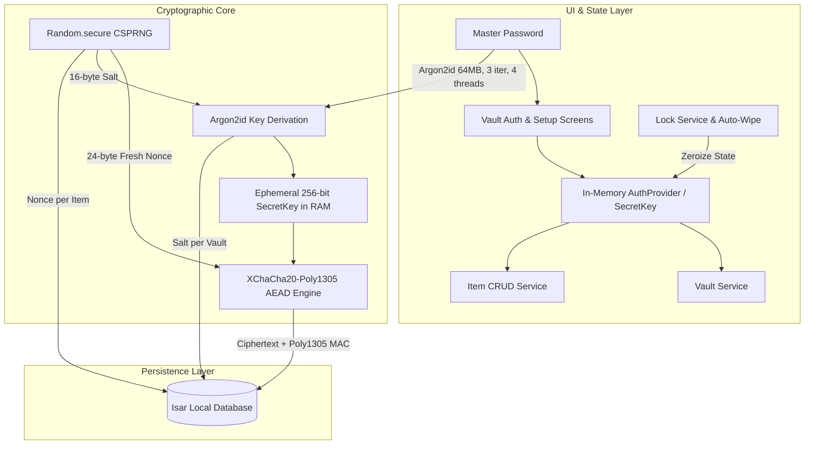

# Firewood

## Executive Summary

Firewood is a high-security, local-first, and completely offline password and credentials manager built with Flutter and Dart. Designed around a strict zero-knowledge security architecture, Firewood ensures that sensitive user secrets—passwords, credit cards, recovery phrases, and private notes—never touch remote servers or unencrypted persistent storage.

Rather than relying on third-party cloud storage or generic database-level encryption, Firewood implements manual, field-level authenticated symmetric encryption with **XChaCha20-Poly1305** and derives 256-bit secret keys using the memory-hard **Argon2id** key derivation function.

## Architecture

---

## 🔐 Cryptographic Specifications

| Component | Algorithm | Configuration / Parameters |
|---|---|---|
| **Key Derivation Function (KDF)** | Argon2id | 64 MB memory (65,536 KB), 3 iterations, 4 parallelism threads, 32-byte key output |
| **Symmetric Encryption (AEAD)** | XChaCha20-Poly1305 | 256-bit secret key, 192-bit (24-byte) random nonce per encryption operation |
| **Authentication Tag** | Poly1305 | 16-byte MAC tag appended to ciphertext, verified before decryption |
| **Salt Generation** | CSPRNG (`Random.secure()`) | 16 bytes (128 bits), generated once per vault creation |
| **Nonce Generation** | CSPRNG (`Random.secure()`) | 24 bytes (192 bits), fresh nonce generated on every single item write/update |

### Core Security Invariants

1. **Zero Persistence of Master Key**: Master passwords and derived `SecretKey` instances exist strictly within volatile RAM. When the vault is locked or backgrounded, state providers are immediately zeroized.
2. **Strict Nonce Freshness**: Every record modification or creation generates a cryptographically unique 24-byte nonce to prevent cryptographic replay attacks and stream cipher degradation.
3. **Tamper-Evident Integrity**: Poly1305 authentication tags verify data authenticity before decryption; any bit-level tampering causes decryption to reject immediately.
4. **Offline Isolation**: Completely zero network telemetry or remote server dependencies, eliminating remote attack vectors.

---

## Key Features & Capabilities

- **Multi-Type Vault Items**: Structured schemas for logins, payment cards, secure notes, and identity documents with dynamic custom fields.
- **Instant Search & Filter**: Local in-memory search over item titles and tags with responsive UI filtering.
- **Clipboard Auto-Wiping**: Automated background clipboard wiping after sensitive credentials or TOTP tokens are copied.
- **Cross-Platform Target**: Native compiled support for Android, iOS, and Linux Desktop with hardware-accelerated rendering.
