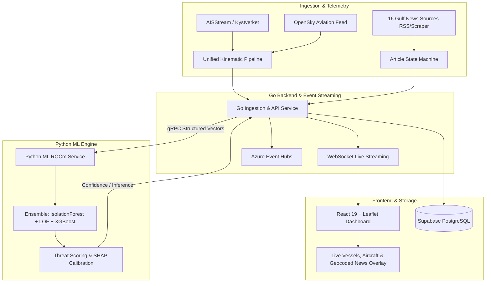

## Executive Summary

HormuzWatch is a unified real-time maritime and aviation surveillance platform paired with a multi-source news intelligence engine for strategic Gulf waterways (Strait of Hormuz, Persian Gulf, Gulf of Oman). It replaces fragmented manual monitoring by combining live AIS vessel feeds, OpenSky aviation telemetry, and an automated 16-source OSINT RSS ingestion pipeline with machine learning anomaly detection and threat scoring.

---

## Key Capabilities & Features

1. **Multi-Source News Intelligence Pipeline**: Ingests from 16 pre-configured Gulf and maritime agencies (WAM, SPA, KUNA, IRNA, USNI News, UKMTO, IMO, etc.).
2. **7-Step ML Article Processing Pipeline**:
   $$\text{Clean} \longrightarrow \text{Dedup} \longrightarrow \text{Language Detect} \longrightarrow \text{NER / Entity Extract} \longrightarrow \text{Classify} \longrightarrow \text{Feature Engineering} \longrightarrow \text{Threat Score}$$
3. **Ensemble Anomaly Detection**: IsolationForest + Local Outlier Factor (LOF) + XGBoost running across 4 distinct domains (maritime vessels, aviation kinematics, geospatial heatmaps, and news event clusters).
4. **Unified Kinematic Ingestion**: Streamlined architecture eliminating code duplication across AISStream, OpenSky, Kystverket, and local simulators.
5. **Real-time Live Geospatial Dashboard**: Interactive Leaflet maps streaming real-time vessel/aircraft positions and geocoded intelligence alerts over WebSockets.
6. **State Machine Tracking**: Articles transition reliably through `QUEUED` $\rightarrow$ `SCORED` $\rightarrow$ `GEOCODED` $\rightarrow$ `STORED` $\rightarrow$ `DONE`.
7. **Unified REST API**: 15 endpoints adhering to a consistent `{ data, total }` response schema with role-based JWT access.

---

## Technical Architecture & Implementation

### Go Backend (Ingestion & APIs)
- Built with **Go 1.23**, Gin HTTP framework, and high-performance gRPC contracts.
- Handles external rate limits, kinematic normalization, coordinate projections, article HTML sanitization, and WebSocket connection pooling.

### Python ML Microservice (Inference & Scoring)
- Built with **Python 3.11** & FastAPI utilizing **PyTorch ROCm**, XGBoost, CuPy, and scikit-learn.
- Receives pre-engineered feature vectors via gRPC contracts without requiring protobuf changes across domain additions.

### Infrastructure as Code & Cloud Architecture
- **Terraform (Azure)** modules for Virtual Networks, Azure Container Apps, Event Hubs, Azure AI Services, and Key Vault.
- Fully automated **dev / test / prod** environments with GitHub Actions plan-on-PR workflows and Cloudflare Tunnel zero-trust ingress.
