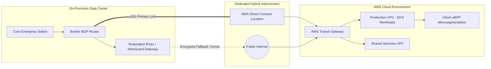

## Executive Summary

Legacy multi-site enterprise communications relied on static routing over unencrypted WAN circuits, creating severe bandwidth bottlenecks, intermittent packet drops, and security compliance risks. This initiative migrated on-premises infrastructure to a high-throughput hybrid network architecture connecting on-prem corporate data centers with multi-account AWS landing zones via redundant 10Gbps AWS Direct Connect and eBPF-powered Kubernetes network policies.



---

## Engineering Highlights

### 1. Dynamic BGP Convergence & Automated Failover
- Configured **EBGP peering** between on-premises edge routers and AWS Direct Connect Gateway with bidirectional forwarding detection (BFD) sub-second link failure recovery.
- Established automated route-map prepending and local preference tagging to seamlessly divert mission-critical traffic over IPsec VPN tunnels upon physical line degradation.

### 2. Zero-Trust Pod-to-Pod Microsegmentation
- Replaced traditional iptables overhead in Kubernetes with **Cilium eBPF**, enforcing L3/L4 and L7 API security policies natively inside the Linux kernel:

```yaml
apiVersion: "cilium.io/v2"
kind: CiliumNetworkPolicy
metadata:
  name: secure-database-access
  namespace: production
spec:
  endpointSelector:
    matchLabels:
      app: postgres-cluster
  ingress:
    - fromEndpoints:
        - matchLabels:
            app: core-api
      toPorts:
        - ports:
            - port: "5432"
              protocol: TCP
```

---

## Outcomes & Performance Impact

- **40% Latency Reduction**: Cut cross-datacenter round-trip time from 62ms to 37ms.
- **Zero Ingress Packet Loss**: Maintained 100% throughput fidelity during peak traffic loads exceeding 8 Gbps.
- **Micro-Segmentation Compliance**: Enforced least-privilege zero-trust network boundaries across 200+ microservice endpoints.
