## Executive Summary

As application scale expanded across geographic zones, monolithic deployments and manual release processes introduced single-point-of-failure vulnerabilities and prolonged maintenance windows. This project involved designing, automating, and operating a fully declarative multi-region Kubernetes infrastructure spanning **AWS us-east-1** (Primary) and **eu-west-1** (Secondary) with real-time health-checked DNS failover and GitOps continuous delivery.

```mermaid
graph TD
    subgraph Developer Workflow
        Dev[Engineer] -->|Push PR / Merge| GitRepo[GitHub Repository]
        GitRepo -->|Trigger| GHActions[GitHub Actions CI]
        GHActions -->|Build & Sign Image| ECR[AWS ECR Container Registry]
        GHActions -->|Update K8s Manifests| ConfigRepo[GitOps Config Repo]
    end

    subgraph GitOps & Cluster Sync
        ConfigRepo -->|Sync & Reconcile| ArgoCD[ArgoCD Controller]
        ArgoCD -->|Progressive Rollout| EKS_US[AWS EKS Primary us-east-1]
        ArgoCD -->|Progressive Rollout| EKS_EU[AWS EKS Secondary eu-west-1]
    end

    subgraph Global Traffic Management
        Users((Global Clients)) -->|HTTPS Anycast| Route53[AWS Route 53 GeoDNS / ARC]
        Route53 -->|Health Check OK| ALB_US[Application Load Balancer US]
        Route53 -->|Failover / Spillover| ALB_EU[Application Load Balancer EU]
        ALB_US --> EKS_US
        ALB_EU --> EKS_EU
    end
```



---

## Key Challenges & Architectural Goals

1. **Active-Active Resilience**: Elimination of single-region dependencies for critical stateful and stateless services.
2. **Deterministic Infrastructure as Code**: 100% of AWS VPCs, Subnets, Transit Gateways, IAM Roles for Service Accounts (IRSA), and EKS clusters provisioned through modular Terraform.
3. **Automated Progressive Delivery**: Safe canary deployments with automated metric rollbacks based on p99 latency thresholds (< 120ms) and HTTP 5xx error rate limits (< 0.1%).
4. **Drift Detection & Remediation**: Automated reconciliation using ArgoCD to prevent unauthorized manual `kubectl` state mutations in production.

---

## Technical Implementation

### 1. Terraform Modular Infrastructure

All cloud resources were structured into reusable Terraform modules with remote S3 state locking via DynamoDB:

```hcl
module "eks_primary" {
  source          = "./modules/aws-eks-cluster"
  cluster_name    = "prod-primary-useast1"
  cluster_version = "1.30"
  vpc_id          = module.vpc_primary.vpc_id
  subnet_ids      = module.vpc_primary.private_subnets

  node_groups = {
    compute_heavy = {
      instance_types = ["m6i.xlarge"]
      min_size       = 3
      max_size       = 12
      desired_size   = 3
      capacity_type  = "ON_DEMAND"
    }
  }

  enable_cluster_autoscaler = true
  enable_aws_load_balancer  = true
}
```

### 2. GitOps Pipeline & Canary Strategy

Application releases were configured using **Argo Rollouts** integrated with Prometheus analysis metrics. During a deployment, traffic is split sequentially (10% -> 25% -> 50% -> 100%) while automated analysis queries verify error budgets before advancing:

```yaml
apiVersion: argoproj.io/v1alpha1
kind: Rollout
metadata:
  name: core-api-service
spec:
  replicas: 10
  strategy:
    canary:
      analysis:
        templates:
          - templateName: error-rate-check
        args:
          - name: service-name
            value: core-api
      steps:
        - setWeight: 10
        - pause: { duration: 5m }
        - setWeight: 50
        - pause: { duration: 10m }
```

---

## Quantifiable Outcomes & Metrics

- **99.99% Service Availability**: Achieved zero unplanned downtime across 12 consecutive months.
- **75% Faster Release Cycles**: Reduced average deployment lead time from 45 minutes to under 10 minutes.
- **MTTR Reduced to < 90 seconds**: Automated DNS failover and fast canary rollbacks minimized incident blast radiuses significantly.
- **Zero Config Drift**: 100% Git-audited changes with pull request peer reviews and automated policy validations.
