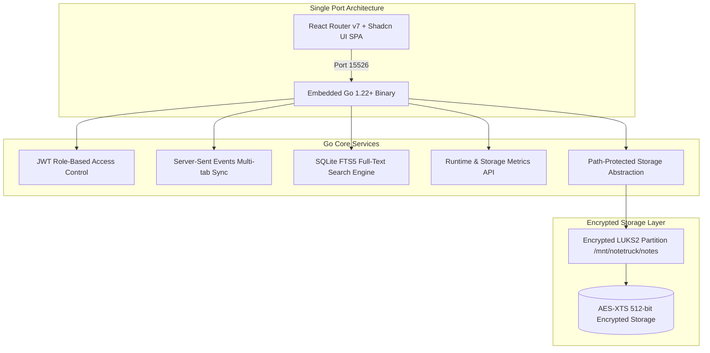

## Executive Summary

NoteTruck is a high-performance single-binary authoring studio and structured knowledge repository engineered for cloud, network, and security certification preparation (AWS Solutions Architect, CKA/CKS, Azure, Cisco CCNP/CCNA). It provides an encrypted, zero-latency local-first markdown/PDF workspace with real-time multi-tab synchronization and lightning-fast full-text search.

---

## Key Features & Capabilities

- **Split-Pane Authoring Studio**: Live Markdown and PDF editor with synchronized scrolling, live LaTeX math rendering, syntax highlighting, word count, and reading time estimation.
- **Global FTS5 Search (Cmd+K)**: Instant full-text fuzzy search across note bodies, tags, categories, and titles with dynamic keyword highlighting.
- **Real-Time SSE Sync**: Multi-device and multi-tab live sync via Server-Sent Events (`GET /api/v1/events`), broadcasting note revisions and asset updates instantly.
- **Encrypted LUKS2 Storage**: Note contents are persisted onto an AES-XTS 512-bit encrypted partition with automated health monitoring thresholds (80% warning, 90% critical, 95% write-lock).
- **Single-Port Embedded Deployment**: React Router SPA assets are compiled and embedded directly into the Go binary via `embed.FS`, serving the entire application on port 15526.
- **System Metrics & Diagnostics**: Built-in runtime observability monitoring goroutines, memory allocation, CPU load, and disk utilization.

---

## Technical Highlights

1. **Storage Abstraction & Security**: Comprehensive path traversal protection, MIME type validation, and 50MB upload limits with auto-slug hierarchical directory organization (`category/domain/assets/`).
2. **Dynamic Partition Management**: Administrative APIs for live partition status inspection, automated garbage collection, and filesystem resizing.
3. **Role-Based Access Control (RBAC)**: Fine-grained JWT authentication separating read-only review modes from full administrative authoring.
