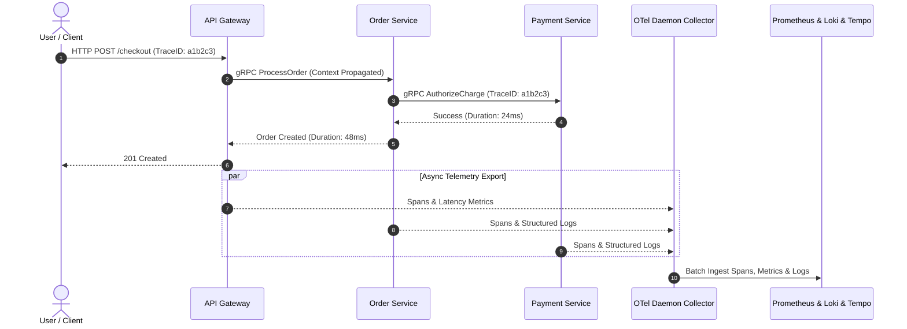

## Executive Summary

As microservices scaled to hundreds of container replicas, troubleshooting cascading latency spikes across asynchronous message brokers and RPC calls became increasingly opaque. This project unified logs, metrics, and distributed traces into a vendor-neutral observability pipeline using the **OpenTelemetry standard**, **Vector log streaming**, and **Grafana / Thanos** distributed storage.

---

## Technical Highlights

### 1. Vendor-Neutral Telemetry Aggregation
- Deployed daemonset **OpenTelemetry Collectors** on every Kubernetes node with memory-limiter and batch processors to minimize resource footprint (< 50MB RAM per node).
- Enforced strict trace context propagation (`traceparent` header) across all REST, gRPC, and RabbitMQ message payloads.

### 2. High-Efficiency Log Pipeline with Vector
- Streamed structured JSON logs through Vector agents with automatic PII sanitization (redacting tokens, emails, and credentials) prior to ingestion into Grafana Loki.

---

## Results & Operational Improvements

- **MTTD Reduced by 60%**: Cut mean time to detect service degradations from 15 minutes to under 6 minutes.
- **Trace Sampling Optimization**: Saved over $14,000/year in cloud storage costs using tail-based intelligent sampling (capturing 100% of 5xx errors and slow p95 requests, and 5% of healthy 200 OK traffic).
