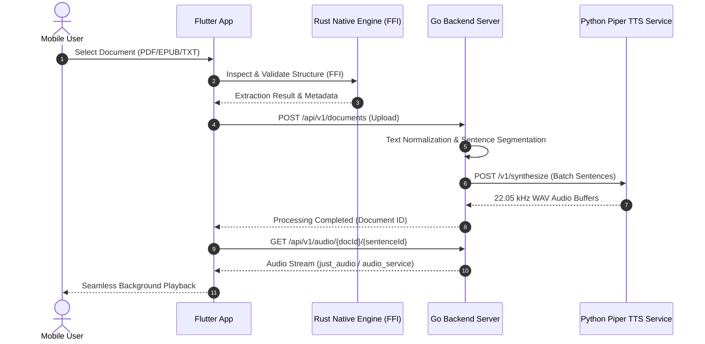

## Executive Summary

RaweeGo is an end-to-end, privacy-respecting document-to-audio platform engineered as a clean monorepo across five isolated domains. It enables mobile users to convert documents into natural, neural-synthesized audio streams locally and efficiently without proprietary cloud speech lock-in.

---

## Monorepo Architecture

The project is structured into five strictly isolated domains to prevent cross-domain pollution:

| Domain | Tech Stack | Role & Responsibility |
|---|---|---|
| `mobile/` | Flutter, Riverpod, `audio_service` | Cross-platform client UI, background playback, state management |
| `native/` | Rust (`raweego_core` crate) | High-speed local document parsing and FFI bridge for mobile |
| `server/` | Go 1.22 (std HTTP, gorilla) | REST API, document ingestion, audio chunking & streaming |
| `tts-service/` | Python, FastAPI, Piper TTS | Neural on-device/local text-to-speech synthesis (22.05 kHz WAV) |
| `website/` | React 19, Vite, Three.js | Interactive marketing portal with WebGL particle visualizers |

---

## Key Features & Highlights

- **Local Neural Speech Synthesis**: Fast, natural speech synthesis powered by Piper TTS microservice running at 22.05 kHz sample rate.
- **Native Document Inspection**: Rust-based core engine embedded directly into mobile builds via FFI for instant metadata extraction and validation.
- **Granular Sentence-by-Sentence Streaming**: HTTP range and chunk-based streaming endpoints enabling instantaneous playback before complete document synthesis finishes.
- **Background Playback & Lock Screen Controls**: Full native mobile integration utilizing `just_audio` and `audio_service` with playlist queuing and speed controls.
- **Integrated Test Harness**: Complete end-to-end vertical slice test suite verifying document ingestion, chunking, TTS synthesis, and audio streaming.
