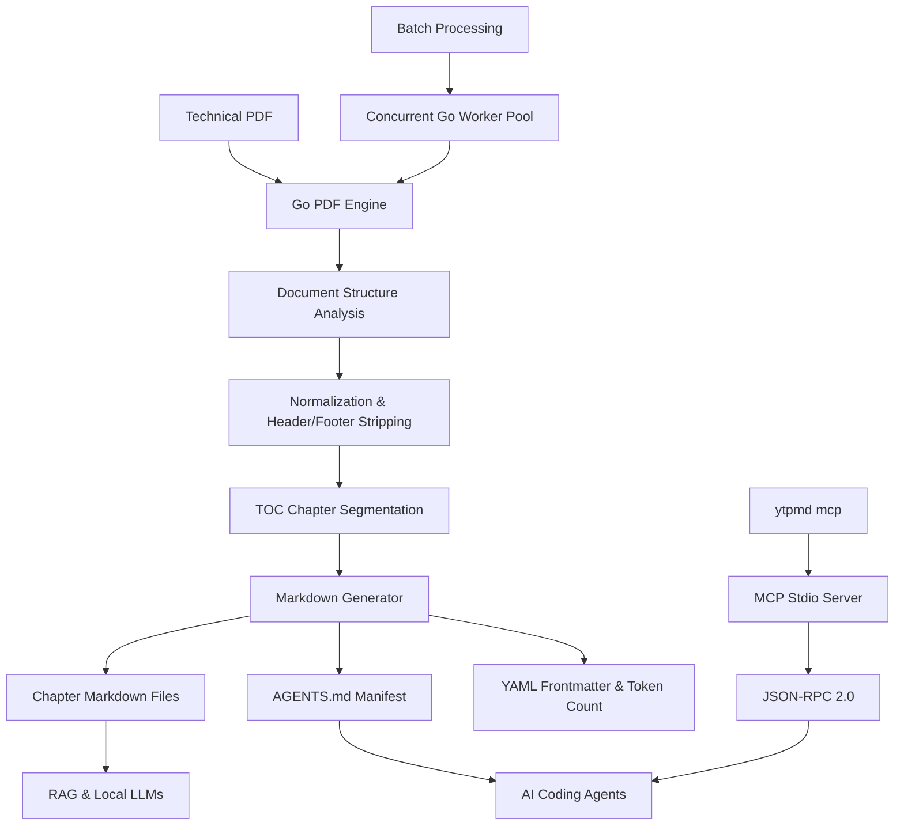

# ytpMD

## Executive Summary

ytpMD is a high-performance, local-first document processing engine built in Go that transforms technical PDF manuals and books into clean, chapter-segmented Markdown libraries. Instead of generating an unwieldy single text dump, ytpMD parses document structure to produce individual chapter files complete with YAML frontmatter, token budgets, breadcrumbs, and an `AGENTS.md` manifest optimized for LLMs, RAG pipelines, and coding agents.



---

## Technical Specifications

| Component | Specification / Approach |
|---|---|
| **Core Engine** | Go 1.23+ with concurrent worker pools for batch processing |
| **Parsing Strategy** | Table-of-contents segmentation with heuristic fallback |
| **Text Normalization** | Header/footer suppression, hyphenation repair, index/biblio cutoff |
| **Metadata Generation** | Per-chapter YAML frontmatter (slug, chapter number, word/token count) |
| **Agent Interface** | Built-in Model Context Protocol (MCP) stdio server over JSON-RPC 2.0 |
| **Distribution** | Standalone static binary, Snap, Homebrew, Debian `.deb`, AUR |
| **Web Showcase** | React 19 + Vite retro terminal interface hosted on Firebase |

---

## Core Capabilities

### 1. Structure-Aware Chapter Segmentation
Rather than relying on naive page splits, ytpMD maps the document's table of contents into distinct chapter files (`01_intro.md`, `02_architecture.md`). Each file includes breadcrumbs and precise source-page references.

### 2. Machine-Ready Manifests (`AGENTS.md`)
Generates an index manifest listing all chapters, topic summaries, and estimated token counts. AI agents (Cursor, Claude Desktop, Antigravity) inspect the manifest first to pull only relevant chapters into context—reducing prompt bloat by up to 80%.

### 3. Native Model Context Protocol (MCP) Integration
Includes a native MCP server invoked via `ytpmd mcp`. Tools exposed via JSON-RPC allow agents to query document outlines, search chapter contents, and retrieve specific sections on demand.

### 4. Zero Cloud Footprint (100% Offline)
Operates entirely on the local machine with no external API calls, telemetry, or cloud dependencies. Confidential engineering documentation and proprietary manuals remain strictly local.

### 5. High-Throughput Batch Processing
Utilizes Go goroutine worker pools to process multi-gigabyte technical book libraries concurrently, maximizing multi-core CPU throughput.

---

## Project Structure & Output Example

```text
DevOps_Handbook/
├── README.md              # Human-readable navigation index
├── AGENTS.md              # Machine-readable token budget & chapter map
├── 01_introduction.md     # Chapter file with YAML frontmatter
├── 02_cloud_native.md     # Normalized Markdown, sanitized headers/footers
└── 03_kubernetes.md       # Preserved code blocks, diagrams, and tables
```

---

## Distribution & Installation

```bash
# Direct installer
curl -fsSL https://raw.githubusercontent.com/ytp24/ytpMD/main/scripts/install.sh | bash

# Model Context Protocol server invocation
ytpmd mcp
```

- **GitHub Repository**: [github.com/ytp24/ytpmd](https://github.com/ytp24/ytpmd)
- **Interactive Showcase**: [ytpmd.aburcloud.com](https://ytpmd.aburcloud.com)
