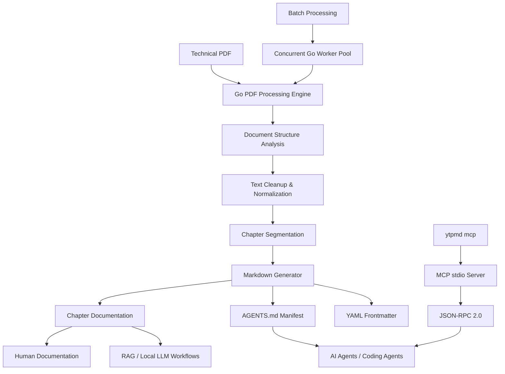

# ytpMD

## Executive Summary

ytpMD is a high-performance, local-first document processing engine that converts technical PDF manuals and books into clean, structured, chapter-segmented Markdown documentation.

Rather than producing one large and difficult-to-use Markdown file, ytpMD analyzes the source document and generates an organized documentation library with individual chapter files, YAML frontmatter, breadcrumb navigation, token estimates, and AI-agent instructions.

The resulting structure is designed to remain useful for both human readers and machine-driven workflows such as RAG systems, local LLM pipelines, coding agents, and Model Context Protocol (MCP) integrations.

## Architecture



## The Problem

Technical PDFs are valuable knowledge sources, but their native structure is poorly suited to modern documentation and AI workflows.

Large technical manuals commonly contain:

- Running headers and footers
- Page numbers
- Broken line wrapping
- Broken hyphenation
- Image references
- Indexes and bibliographies
- Appendices
- Front matter
- Unstructured extracted text
- Large amounts of irrelevant context

For AI systems, the problem becomes more significant. Supplying an entire technical book to an LLM increases context consumption, reduces retrieval precision, and makes it harder for an agent to identify the relevant chapter or section.

## The Solution

ytpMD transforms a PDF into a structured documentation library.

A typical generated project looks like:

```text
DevOps_Handbook/
├── README.md
├── AGENTS.md
├── 01_introduction.md
├── 02_cloud_native.md
└── 03_kubernetes.md
```

Each generated chapter is enriched with structured metadata such as:

- Chapter number
- Total chapter count
- Source document
- Source page
- Word count
- Estimated token count
- Agent instructions
- Navigation metadata

This turns a PDF into a repository-like knowledge structure rather than a single extracted text file.

## AI-Agent Architecture

A central design goal of ytpMD is making generated documentation immediately understandable to AI agents.

The tool automatically generates an `AGENTS.md` manifest describing the document structure, chapter mappings, and token metrics.

An agent can therefore inspect the manifest first and determine:

1. What document is available
2. How the document is divided
3. Which chapter is relevant
4. Approximately how much context each chapter contains
5. Which files should be loaded for a particular task

This supports efficient context selection instead of forcing an AI system to process the complete source document.

The generated documentation can be used with:

- Local LLM workflows
- RAG pipelines
- LangChain
- LlamaIndex
- Coding agents
- AI development environments
- Custom document-processing agents

## MCP Integration

ytpMD includes an MCP stdio server that exposes the generated documentation to compatible AI environments.

```bash
ytpmd mcp
```

The MCP integration uses the Model Context Protocol and JSON-RPC 2.0 to provide an agent-oriented interface to the documentation workflow.

It is designed for environments including:

- Cursor
- Claude Desktop
- Google Antigravity
- VS Code
- Other MCP-compatible clients

This allows ytpMD-generated documentation to become part of an agent's working context without requiring the original PDF to be repeatedly processed.

## Document Processing Pipeline

ytpMD focuses on producing useful technical documentation rather than performing raw text extraction.

The processing pipeline includes:

```text
PDF
 │
 ├── Document validation
 │
 ├── Encryption detection
 │
 ├── Text extraction
 │
 ├── Front-matter analysis
 │
 ├── Table-of-contents analysis
 │
 ├── Chapter detection
 │
 ├── Header/footer cleanup
 │
 ├── Hyphenation cleanup
 │
 ├── Appendix detection
 │
 ├── Index/bibliography cutoff
 │
 └── Markdown generation
```

The output is designed to preserve meaningful document structure while removing common extraction noise.

## PDF Processing

The engine handles several common PDF-processing conditions:

- Table-of-contents-based chapter segmentation
- Front-matter skipping
- Header and footer cleanup
- Hyphenation normalization
- Appendix detection
- Index detection
- Bibliography cutoff
- Scanned-document warnings
- Encrypted PDF detection
- Markdown generation
- Chapter-level metadata generation

The result is a cleaner and more predictable documentation corpus for downstream tooling.

## Performance

The core conversion engine is implemented in Go with concurrency as a primary design consideration.

Batch processing can use worker goroutines to process multiple PDFs in parallel rather than requiring sequential conversion.

This architecture is intended for workflows involving:

- Large technical documentation collections
- Multiple certification books
- Repeated document conversion
- Local knowledge-base construction
- Automated ingestion pipelines

## Local-First Design

ytpMD is designed around local document processing.

The conversion workflow does not require:

- Telemetry
- Mandatory cloud processing
- External AI APIs
- Uploading source PDFs to a hosted processing service

PDFs are processed locally and Markdown documentation is generated locally.

This makes the tool appropriate for technical documentation and knowledge sources that users prefer to keep on their own systems.

## Generated Documentation Structure

A generated documentation directory contains more than extracted chapter text.

```text
Documentation/
├── README.md
├── AGENTS.md
├── 01_chapter.md
├── 02_chapter.md
├── 03_chapter.md
└── ...
```

`README.md` provides human-oriented navigation.

`AGENTS.md` provides machine-oriented document structure and token information.

Individual chapter files contain the actual documentation together with YAML frontmatter.

This creates a lightweight convention for using the same documentation repository from both traditional Markdown tooling and AI-agent workflows.

## Installation

ytpMD provides multiple installation methods.

The installation script can be used directly:

```bash
curl -fsSL https://raw.githubusercontent.com/ytp24/ytpMD/main/scripts/install.sh | bash
```

The project also supports package-based installation through:

- Snap
- Homebrew
- AUR
- Debian packages

## Web Application

The project includes a retro Windows 95-inspired showcase application built with React and Vite.

The web application provides an interactive presentation layer for the command-line tool and its ecosystem.

It includes:

- Interactive terminal simulation
- Installation commands
- Package download information
- SHA256 checksums
- MCP configuration
- Interactive documentation
- Project architecture information

The showcase is hosted through Firebase Hosting.

## Technology

### Core Engine

- Go
- PDF processing
- Concurrent worker pools
- Markdown generation
- YAML frontmatter

### AI Integration

- Model Context Protocol
- JSON-RPC 2.0
- AI-agent manifests
- RAG-oriented document structure

### Web

- React
- Vite
- CSS
- Firebase Hosting

## Design Principles

### Local First

Source documents should not need to leave the user's machine simply to become structured Markdown.

### Structure Over Raw Extraction

The objective is not merely to extract text. The objective is to produce documentation that retains useful document hierarchy.

### Human and Machine Readability

Generated Markdown should remain understandable to humans while exposing enough structure for automated systems and AI agents.

### Efficient Context Usage

Chapter segmentation, token estimates, and agent manifests allow downstream systems to select relevant context rather than loading entire books unnecessarily.

### Portable Output

The generated documentation consists of ordinary Markdown and YAML metadata, making it usable with standard developer tooling without requiring a proprietary database or hosted platform.

## Use Cases

ytpMD can be used for:

- Technical books
- Certification manuals
- Engineering documentation
- Internal PDF knowledge bases
- RAG corpus preparation
- Local LLM knowledge repositories
- AI-agent context preparation
- Developer documentation pipelines
- Batch PDF-to-Markdown conversion

## Open Source

ytpMD is released under the Apache License 2.0.

The project continues to evolve across PDF extraction, packaging, testing, documentation, and AI-agent workflows. Contributions, feedback, and ideas are welcome as the project continues to evolve.

## Links

- GitHub: https://github.com/ytp24/ytpMD
- Demo: https://ytpmd.web.app
